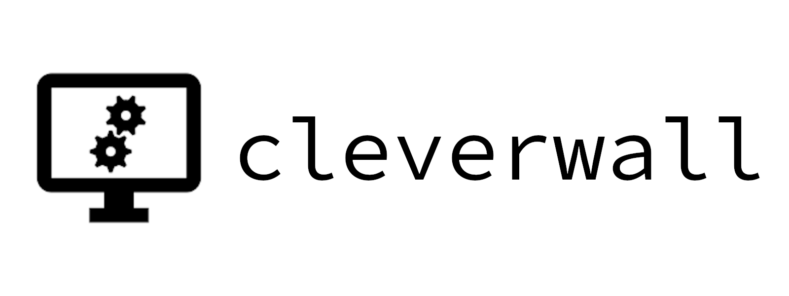

`cleverwall` is an open-source neural net for detecting and countering threats on a local network.

An important note: CLEVERWALL IS NOT YET COMPLETE, as I basically have no clue what I'm doing. It may be another couple of months. Here are my current plans:

PHASE 1: Passive + Static Network IDS (Forensics)
-------------------------------------------------
- [x] A traffic capture (Wireshark PCAP) is analyzed with `suricata` and a base ruleset is generated.
- [x] The original capture data and `suricata`'s resulting `eve.json` log are loaded into cleverwall as a `TrafficDataset`.
- [x] `cleverwall` will use some model of neural net (I'm currently working on optimizing a feed-forward model, and may move to RNN) to identify patterns in packet data (hex dumps) that correspond to malicious activity.
- [ ] `cleverwall` will then flag packets it deems malicious and log them, much like `suricata`.

PHASE 2: Active + Dynamic Network IPS (Network Defense)
-------------------------------------------------------
**Please note that this is not yet a solidified concept. The implementation of the final release may greatly differ.**
- [x] Traffic is captured during active hours ([I currently have an external setup for this](https://github.com/turtlebasket/capturey), but it will likely change)
- [ ] When the network is inactive (presumably at night), that day's traffic is reviewed and iterated over until a certain success rate is reached.
- [ ] Traffic that is deemed malicious is flagged and stored.
- [ ] Stored packets are used to generate rules for `suricata`, which will take future actions accordingly.